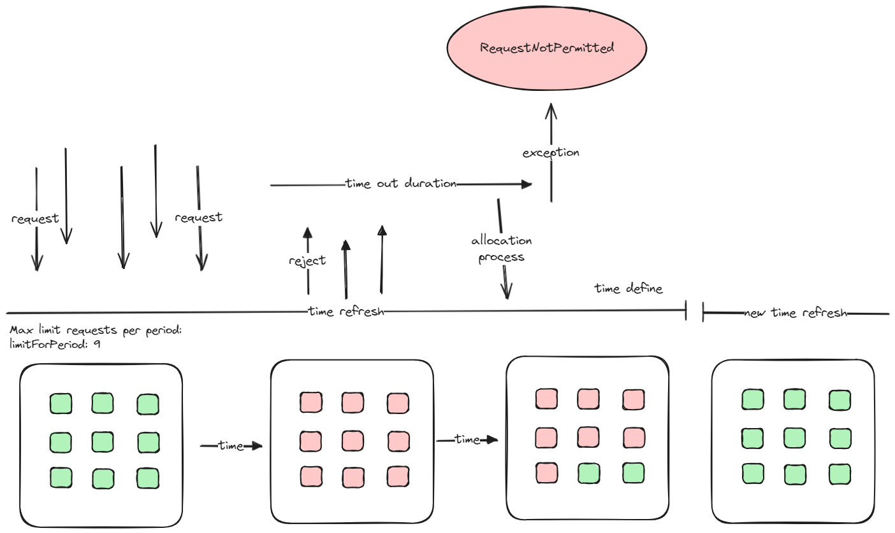
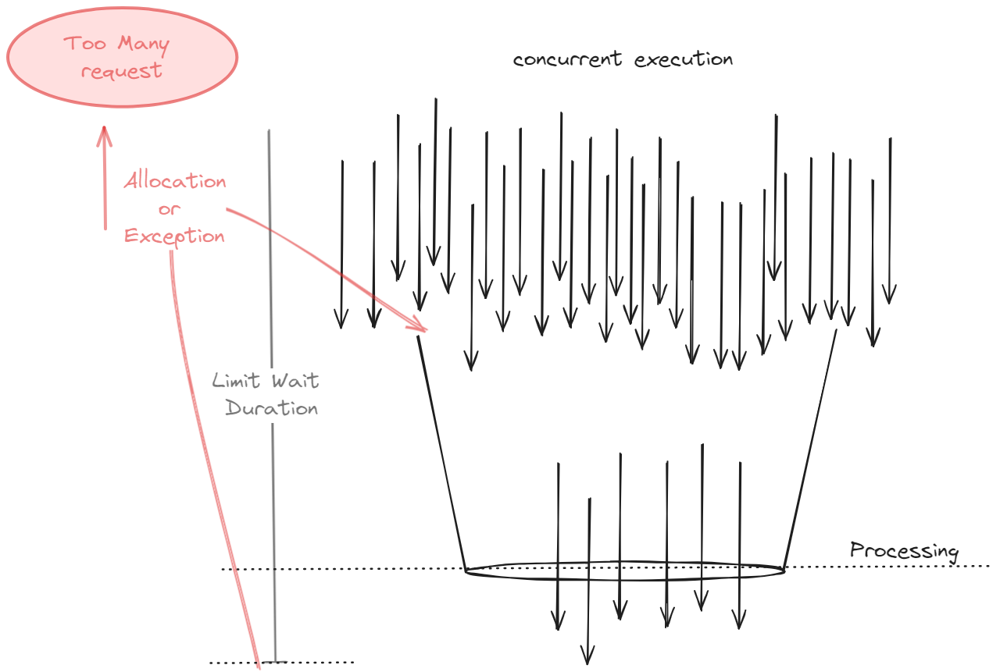

# Estudo POC - Uso recursos resilience4j

Esse matérial tem como objetivo explorar o uso dos recursos oferecidos pelo Resilience4j, uma biblioteca de tolerância a falhas para Java. O Resilience4j oferece mecanismos para lidar com falhas de forma eficaz e fornecer maior resiliência em sistemas distribuídos. Vamos explorar os principais recursos da biblioteca, como RateLimiter, Bulkhead e Retry, e analisar seus resultados em um cenário de aplicação.


## Tópicos

- RateLimiter
- Bulkhead
- Analise desempenho com Jmeter


## RateLimiter

RateLimiter é um padrão de controle de taxa que limita a quantidade de solicitações que podem ser realizadas em um determinado período de tempo. Esse padrão é útil para evitar a sobrecarga de um sistema e garantir que ele permaneça responsivo.

**Exemplo Configuração YAML para RateLimiter:**

	resilience4j:
      ratelimiter:
        instances:
          myRateLimiter:
            limitForPeriod: 10
            limitRefreshPeriod: 1s
            timeoutDuration: 500ms
            # Outras propriedades opcionais podem ser adicionadas conforme necessário

- **limitForPeriod:** Define o número máximo de permissões que podem ser adquiridas por período.
- **limitRefreshPeriod:** Intervalo de tempo em que o número de permissões é reiniciado.
- **timeoutDuration:** Duração máxima que uma solicitação pode aguardar por uma permissão antes de falhar.


### Fluxo de funcionamento de requisições

A image abaixo visa ilustrar o funcionamente dos ciclos do rate emulando request e demostrando a capacidade de tolerancia caso todos os slots definidos estejam ocupados. Ainda assim conseguimos configurar um time para que request consiga sequenciar. Caso contrario será laçado uma exception.

Lembrando que conforme é configurados as instancias ou defult sobre esse recurso, teremos impactos na performasse do serviço.




---

## Bulkhead
Bulkhead é um padrão de design que isola diferentes partes de um sistema para que falhas em uma parte não causem o colapso de toda a aplicação. Em termos de semáforos, isso significa limitar a quantidade de chamadas simultâneas que podem ser feitas a um recurso específico para proteger outros recursos e a aplicação como um todo.

O Resilience4j fornece duas implementações de um padrão bulkhead que pode ser usado para limitar o número de execuções simultâneas:

- Uso de semáforos Semaphore Bulkhead
- Uso de fila limitada e um pool de threads fixo ou FixedThreadPoolBulkhead

>Sera abordados aqui somente o uso Semaphore Bulkhead

**Exemplo Configuração YAML para Bulkhead:**

	resilience4j:
      bulkhead:
        instances:
          myBulkhead:
            maxConcurrentCalls: 10
            maxWaitDuration: 500ms
            # Outras propriedades opcionais podem ser adicionadas conforme necessário

- **maxConcurrentCalls:** Define o número máximo de chamadas concorrentes que podem acessar o recurso ao mesmo tempo.
- **maxWaitDuration:** Define o tempo máximo que uma chamada pode aguardar por uma permissão antes de ser rejeitada.

### Fluxo de funcionamento de requisições

No contexto do Resilience4j o Bulkhead utiliza semáforos para controlar o número de chamadas concorrentes a um determinado recurso. Os semáforos ajudam a garantir que o sistema não se sobrecarregue ao limitar o número de threads que podem acessar um recurso simultaneamente.

Nesse cenario abaixo exploramos uso concorrente mostrado de uma maneira visual como pode se compreender o funcionamento e visualizar os impactos de cada configuração frente a esse cenario de semáforos Semaphore Bulkhead.



### Comportamento e Benefícios
- Limitação de Concurrency: O semáforo garante que não mais do que um número especificado de chamadas simultâneas possam acessar o endpoint ao mesmo tempo. Se o número máximo de chamadas concorrentes for atingido, as chamadas adicionais terão que esperar ou serão rejeitadas se o tempo de espera exceder o máximo configurado.
- Isolamento de Falhas: Se um recurso específico estiver sobrecarregado ou falhar, o Bulkhead ajuda a evitar que isso afete outros recursos da aplicação. Isso é especialmente útil para manter a resiliência da aplicação em ambientes com alta carga.
- Proteção Contra Sobrecarga: Impede que uma avalanche de solicitações simultâneas cause um impacto negativo na performance ou estabilidade da aplicação, protegendo o sistema contra picos inesperados de carga.


## Analise desempenho com Jmeter

Com objetivo de metrificar a parametrizações do uso de rateLimiter e bulkhead do resilience4j, foram executado alguns cenarios.

Ferramenta: [Jmeter](https://jmeter.apache.org/download_jmeter.cgi)

Endpoint:
```text
(POST) http://{{host}/resilience{{version}}
```
Version:
```text
v1 = RateLimiter - simpleRateLimit
v2 = RateLimiter - rateLimiterEventsSpecific
v3 = Bulkhead - bulkheadWithConcurrentCalls
```

Body example:
```json
{
  "endereco": {
    "rua": "teste",
    "numero": 3,
    "estado": "teste"
  },
  "itens": [
    {
      "id": 6565,
      "qtd": "6"
    }
  ]
}
```

### Configuração dos teste de carga
Todos os teste foram definidos com 1000 request de maneira simultanea (proximo disso)
>V1


>V2


>V3


### Parametros utilizados

**IMPORTANTE RESALTAR AQUI**: todos os eventos POST tem time de processamento da thread um sleeping 10s

Foi adequado os parametros conforme abaixo para possibilitar uma analise
>V1


>V2


>V3


## Resultados

>V1 - Podemos verificar no teste **rateLimit** definido com 50 request com refresh 8s timeoutDuration de 2s. Tivemos como saida um Throughput de 72.3/sec ou seja maior V3* - bulkhead - A taxa de erro ficou 85% com average 8s
 


>V2 - Nesse teste **rateLimite** foi reduzido o timeoutDuration para 0, ou seja, pode se verificar que o percentual de erro aumentou 10%, porém Throughput (211,3/sec) melhorou, ou seja, conseguimos atender mais request porém com maior indice de erro. 


>V3 - O uso **Bulkhead** limitamos em 50 request com maxWaitDuration em 4s. Pode se verificar uma taxa de erro 55%, é menor do que foi parametrizados no teste de RateLimiter. Porém um Throughput 35,2/sec que indica uma capacidade menor de atender request por segundo. Outro fator que pode se destacar é aumento medio do time de response, porém como processamento está definifo em 10s e com menor taxa de erro pode se entender como um efeito da parametrização.  


>V3 - Outro teste elaborado foi a de reduzir na estrategia de **Bulkhead** o maxWaitDuration para zero. Isso faz com que não se aguarde liberação na fila de processamento. Verificamos maior percentual de erro e Throughput (10.1/sec) menor capacidade por segundo. Como conseguencia maior indice de erro, temos menor tempo de resposta.


### Utilização 

#### Docker

build:
```shell
docker build -t api-app:latest .
```

run:
```shell
docker run -d -p 8080:8080 --name api-app-container api-app:latest
```

#### Postman

Para emular as chamadas pode se utilizar o [Postman](https://www.postman.com/downloads/).

Segue a collection: 

[Spring - resilience4j.postman_collection.json](docs%2FSpring%20-%20resilience4j.postman_collection.json)


